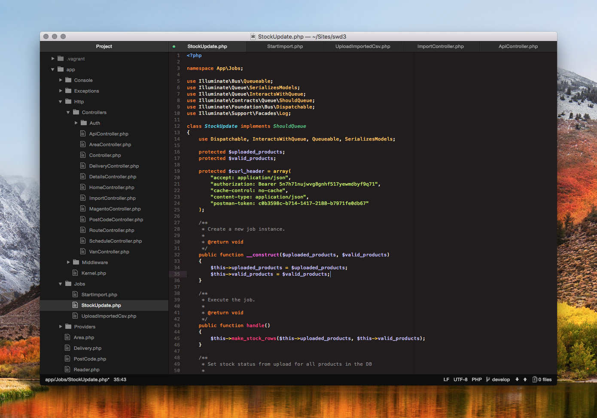

# Delta UI

A Mac OS X dark mode theme. Originally based on the HUD windows, it has been modified to match prerelease versions of a system-wide dark mode in OS X El Capitan, and now updated to fit in with macOS Mojave's official dark mode. Named after Δ, a difference, the background, foreground, shading and highlight colours are shifted.

